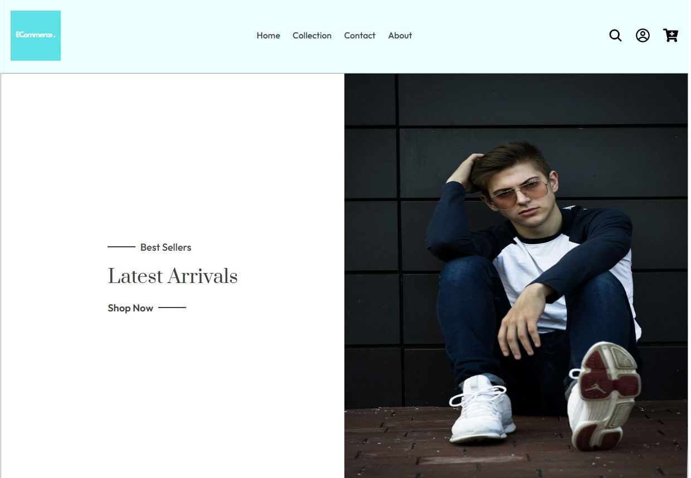

# Digital Commerce Platform

## Introduction

This project involves creating a full-stack e-commerce application with React and Redux for the frontend, and ASP.NET Core 8 for the backend. The goal is to provide a seamless shopping experience for users, along with a robust management system for administrators.

- **Backend**: ASP.NET Core, Entity Framework Core, PostgreSQL
- **Frontend**: Material UI, TypeScript, React, Redux Toolkit, TailwindCSS

---

## Features

- **User Management**: Registration, login, password management, and profile updates.
- **Order Management**: Creating, updating, and tracking orders.
- **Product Management**: CRUD operations for products.
- **Review System**: Users can review products they have purchased.
- **Security**: Secure password hashing and authentication.

---

## E-Commerce Platform Preview
### 🖼️ Collection Page


### 🦸 Landing


### 🛒 Shopping Cart


## Architecture and Design

### Back-End Structure

#### CLEAN Architecture

The backend project follows CLEAN architecture principles, ensuring separation of concerns across different layers:

1. Domain Layer: Core business logic and rules.
2. Service Layer: Contains application services that communicate between the domain and the presentation.
3. Infrastructure Layer: Database, external services, and configurations.
4. Presentation Layer: API controllers for backend and React for frontend.

```plaintext
├── Ecommerce.Domain
│   ├── Enums
│   ├── src
│   │   ├── Auth
│   │   ├── Entities
│   │   ├── Exceptions
│   │   ├── Interfaces
│   │   ├── Model
│   │   └── Shared
│   |   └── Ecommerce.Domain.csproj
├── Ecommerce.Infrastructure
│   ├── Migrations
│   ├── Properties
│   ├── src
│   │   ├── Repository
│   │   └── Database
│   |   └── Ecommerce.Infrastructure.csproj
├── Ecommerce.Presentation
│   ├── src
│   │   ├── Controllers
│   │   └── Middleware
│   |   └── Ecommerce.Presentation.csproj
├── Ecommerce.Service
│   ├── src
│   │   ├── UserService
│   │   ├── OrderService
│   │   ├── ...
│   │   ├── ...
│   │   └── Shared
│   |   └── Ecommerce.Service.csproj
├── Ecommerce.Tests
│   ├── src
│   │   ├── Domain
│   │   └── Service
│   |   └── Ecommerce.Tests.csproj
└── .gitignore
└── Ecommerce.sln
```

### Front-End Structure

```plaintext
├── ECommerce
|   ├── public
│   ├── src
│   │   ├── assets
│   │   ├── components
│   │   ├── feature
│   │   ├── layout
│   │   ├── pages
│   │   ├── redux
│   │   ├── services
│   │   ├── types
│   │   ├── App.tsx
│   │   ├── index.css
|   |   └── main.tsx
├── .gitignore
├── package.json
└── index.html
```

## Getting Started

### Prerequisites

- [.NET 8 SDK](https://dotnet.microsoft.com/en-us/download/dotnet/8.0)
- [pgAdmin 4](https://www.pgadmin.org/download/)
  - Configure PgAdmin 4 [pgAdmin](https://www.pgadmin.org/docs/pgadmin4/development/connecting.html)
- [Node.js](https://nodejs.org/en/download/package-manager)

### Installation

1. **Clone the project repository**:

```sh
  git clone https://github.com/Arshiakhan50/E-Commerce-Platform.git
  cd E-Commerce-Platform

```

2.  **Set up the database**:

```sh
  cd backend/Ecommerce.Infrastructure
  mkdir appsettings.json
```

- Create new file called `appsettings.json` located in the `Ecommerce.Infrastructure` project to contain connection string. It should contain your Database name, username and password beside JWT key as the following:

  ```sh
  {
  "Logging": {
    "LogLevel": {
      "Default": "Information",
      "Microsoft.AspNetCore": "Warning"
    }
  },
  "AllowedHosts": "*",
  "ConnectionStrings": {
    "localhost": "Host=localhost;Database={your data base name};Username={user name from pgAdmin 4};Password={password from pgAdmin 4};"
  },
  "Jwt": {
    "Key": "your secret key to generate the token",
    "Issuer": "Name",
    "Audience": "http://localhost:5096/"
  }
  ```

- Create and run database migrations to set up the initial schema:

```sh
dotnet ef migrations add CreateDb
dotnet ef database update
```

3. **Start the backend server**:

```bash
dotnet run dev
```

4. **Start the frontend**:

```bash
cd ../../frontend
npm run dev
```
